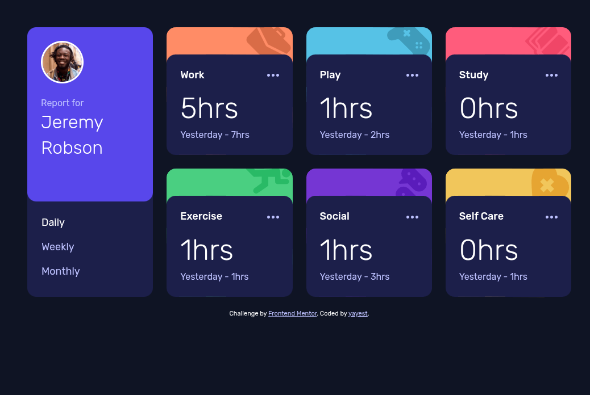

# Frontend Mentor - Time tracking dashboard solution

This is a solution to the [Time tracking dashboard challenge on Frontend Mentor](https://www.frontendmentor.io/challenges/time-tracking-dashboard-UIQ7167Jw). Frontend Mentor challenges help you improve your coding skills by building realistic projects. 

## Table of contents

- [Frontend Mentor - Time tracking dashboard solution](#frontend-mentor---time-tracking-dashboard-solution)
  - [Table of contents](#table-of-contents)
  - [Overview](#overview)
    - [The challenge](#the-challenge)
    - [Screenshot](#screenshot)
    - [Links](#links)
  - [My process](#my-process)
    - [Built with](#built-with)
    - [What I learned](#what-i-learned)
    - [Continued development](#continued-development)
    - [Useful resources](#useful-resources)
  - [Author](#author)

## Overview

### The challenge

Users should be able to:

- View the optimal layout for the site depending on their device's screen size
- See hover states for all interactive elements on the page
- Switch between viewing Daily, Weekly, and Monthly stats

### Screenshot



### Links

- Solution URL: [Add solution URL here](https://github.com/yayest/time-tracking-dashboard-main)

## My process

### Built with

- Semantic HTML5 markup
- CSS custom properties
- Flexbox
- CSS Grid
- Mobile-first workflow

### What I learned

I enjoyed working with CSS Grid, I think my solution is not very optimal. I'm not sure if I used media queries correctly in different places of the css file. I tried not to use unnecessary tags in HTML markup. And I'm very weak in JS, I barely wrote the timeframes switch.

```html
      <section class="card work">
        <div class="timeframes">
          <div class="actions">
            <h2 class="title">Work</h2>
            <a href="" class="action"><svg width="21" height="5" xmlns="http://www.w3.org/2000/svg"><path d="M2.5 0a2.5 2.5 0 1 1 0 5 2.5 2.5 0 0 1 0-5Zm8 0a2.5 2.5 0 1 1 0 5 2.5 2.5 0 0 1 0-5Zm8 0a2.5 2.5 0 1 1 0 5 2.5 2.5 0 0 1 0-5Z" fill="currentColor" fill-rule="evenodd"/></svg></a>
          </div>
          <div class="timeframe daily active">
            <p class="time-current"><span>5</span>hrs</p>
            <p class="time-previous">Yesterday - <span>7</span>hrs</p>
          </div>
          <div class="timeframe weekly">
            <p class="time-current"><span>32</span>hrs</p>
            <p class="time-previous">Last Week - <span>36</span>hrs</p>
          </div>
          <div class="timeframe monthly">
            <p class="time-current"><span>103</span>hrs</p>
            <p class="time-previous">Last Month - <span>128</span>hrs</p>
          </div>
        </div>
      </section>
```
```css
  .timeframe.active {
    display: grid;
    grid-template-columns: min-content 1fr;
    grid-column: 1 / 3;
    align-items: center;
    @media (width > 60em) {
      grid-template-columns: 1fr;

      .time-previous {
        --horizontal-alignment: start;
      }
    }
  }
```
```js
const actions = document.querySelectorAll("button[data-timeframes]");
const timeframes = document.querySelectorAll(".timeframe");

actions.forEach((element) => {
  element.addEventListener(
    "click",
    () => {
      actions.forEach((button) => {
        button.classList.remove("active");
      });
      element.classList.add("active");

      timeframes.forEach((timeframe) => {
        if (timeframe.classList.value.includes(element.dataset.timeframes)) {
          timeframe.classList.add("active");
        } else {
          timeframe.classList.remove("active");
        }
      });
    },
    false
  );
});
```
### Continued development

I think we need to understand css grid in more detail, the correct use of media queries, and start learning js.

### Useful resources

- [HTML & CSS for Absolute Beginners](https://www.youtube.com/watch?v=1L2YiWdaUDM&list=PL4-IK0AVhVjOJs_UjdQeyEZ_cmEV3uJvx) - This Kevin Powell course helped me a lot.
- [A Treasure Trove of knowledge from Kevin Powell](https://www.youtube.com/@KevinPowell) - Lots of interesting recipes
- [MDN Web Docs](https://developer.mozilla.org/en-US/)

## Author

- Website - [yayest](https://github.com/yayest/)

